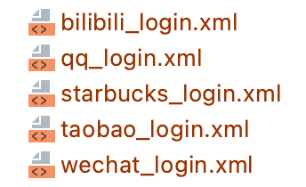
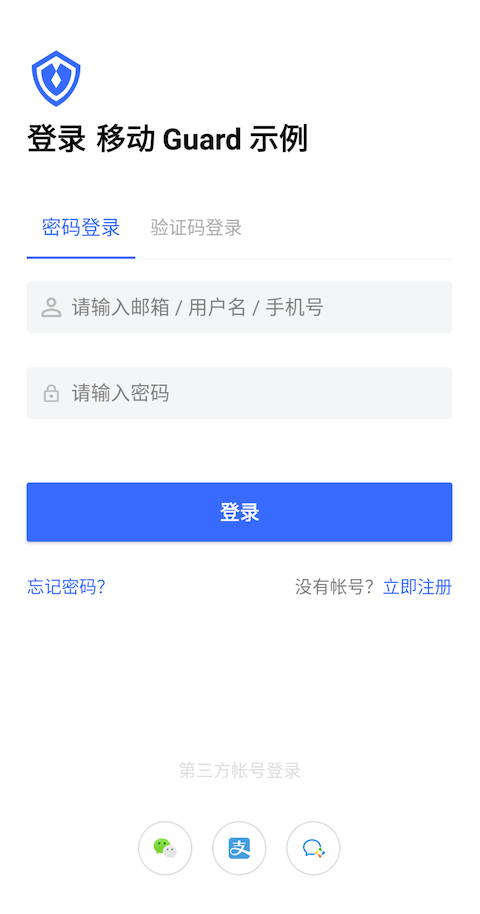

# Authing Android Guard

Authing android guard 是一个面向身份认证领域的业务组件库，该组件库将复杂的认证系统语义化，标准化。通过使用该组件库，业务 App 可以极速实现认证流程。相比手动实现，效率提升 x10。

<br>

## 开始之前

强烈建议先浏览至少 2 份下面的报告再回来继续阅读，这样对移动认证的复杂性才能有一个大的轮廓。我们在 Guard 设计开发之前，花了大量时间对业界主流 App 登录界面进行了深入分析。

[查看报告](./doc/auth_reports.md)

<br>

## 适用场景

* 初创。需要快速搭建 App MVP，不想为认证功能投入太多资源
* 长期演进。认证模块的复杂性内置到我们组件里面，由我们负责和业界的持续对标，业务 App 只需要聚焦业务功能

<br>

## 快速开始

最快的接入方式是使用我们海量的模板。通过我们 Guard 组件，预置了 100+ 基于业务（行业）的登录/注册界面模板。开发者只需要选择自己的行业，拷贝对应的模板，即可在 10 分钟内实现复杂的，完整的认证流程。

步骤一：添加依赖

``` gradle
implementation 'cn.authing:guard:1.0.2'
```

步骤二：在本项目的 app/src/main/res/layout 目录下选择适合自己 App 的模板布局文件，如：



步骤三：在应用启动的时候，如 Application 的 onCreate 方法，调用：

```java
Authing.init(appContext, "your_authing_app_id");
```

步骤四：在自己项目的登录 Activity 里面加载对应布局模板文件

```java
@Override
protected void onCreate(Bundle savedInstanceState) {
    super.onCreate(savedInstanceState);
    setContentView(R.layout.starbucks_login);
}
```

<br>

## 使用 Authing 风格的原生界面 [接入步骤](./doc/start_with_authing.md)

如果应用可以接受我们的标准 UI，则可以通过上面简单的步骤快速接入。



<br>

## 组件使用指南

### Widgets

[AppLogo](./doc/hc_app_logo.md)

[AppName](./doc/hc_app_name.md)

[AccountEditText](./doc/hc_account_edit_text.md)

[PasswordEditText](./doc/hc_password_edit_text.md)

[LoginButton](./doc/hc_login_button.md)

[PhoneNumberEditText](./doc/hc_phone_number_edit_text.md)

[VerifyCodeEditText](./doc/hc_verify_code_edit_text.md)

[CountryCodePicker](./doc/hc_country_code_picker.md)

[ErrorTextView](./doc/hc_error_text_view.md)

### 聚合控件

[LoginMethodTab](./doc/hc_login_method_tab.md)

[LoginContainer](./doc/hc_login_container.md)

[PrivacyConfirmBox](./doc/hc_privacy_confirm_box.md)

[SocialLoginListView](./doc/hc_social_login_list_view.md)

CapchaView

RegisterCompletionForm

### 弹窗

SendSMSDialog

LogoutDialog

<br>

## 深入了解 Authing Android Guard 组件设计细节

一般来说，头部 App 厂商会维持一个 10 人左右的团队，全职开发和维护认证相关的界面和逻辑。这是一笔不小的开销，原因在于登录界面的易用性，健壮性直接决定了付费用户转换率。想象一下，多少次当一个 App 让你登录的时候，也就是你放弃这个 App 的时候。而为了获得付费用户，又必须首先让用户登录。

另外一方面，安全性也需要巨大的投入。安全问题的特殊性在于，如果不出问题感觉不需要投入，可一旦出问题，损失都非常惨重。

Authing 作为认证领域专家，将数年认证经验沉淀在 Guard 组件里面，可以极大节约开发成本，降低安全风险。接下来，我们深入探讨 Authing 在设计 Guard 组件时所面临的巨大挑战以及我们的解决方案，同时站在软件开发的角度聊一些技术细节。

### 一 设计理念
1. 将一个自然人数字化
2. 设计一套高内聚，低耦合的组件库
3. 隐私和安全（隐私协议，GDPR，防截屏，每次登录，MFA，异常登录）
4. 命名考虑（组件名，属性名，接口名）

### 二 主流程
1. 手机号一键登录
2. 其他快速注册的手段
3. 注册信息补全
4. 支持多种形式的用户名
5. 关于短信验证码的思考
6. 合并注册与登录
7. 登录按钮的设计以及回调
8. 根据后台配置自动触发 MFA（Multi-Factor Authentication）
9. MFA 详解以及手动触发
10. 登出

### 三 UX & UI 交互和界面
1. 提示语位置思考
2. Splash 界面和自动登录
3. 为什么不使用 TextInputLayout

### 四 更多认证方式
1. [社会化登录](./doc/social.md)
2. 扫描二维码登录
3. 通过 Biometric API 支持指纹登录
4. 人脸识别登录

### 五 高级功能
1. 使用 Authing 提供的网络拦截器发送业务请求
2. 将你的 App 作为认证源
3. 自带监控能力：Crash，Log，设备分布，用户画像
4. 实名认证
5. 通过 Authing 接入虚拟网络，实现在移动端访问公司内网
6. 防截屏
7. 给图片加上带个人信息的水印
8. 远程擦除本地数据
9. Authing Audit（审计功能）
10. 设备互斥与强制下线
11. 深色模式
12. 多设备适配
13. [AppAuth](./doc/topics/app_auth.md)
