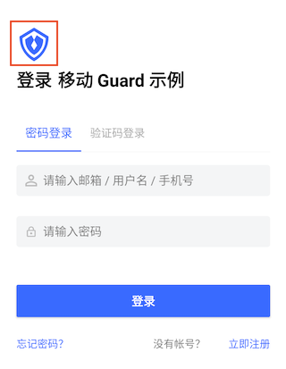

# 应用图标 AppLogo

## 布局文件使用方式
```xml
<cn.authing.guard.AppLogo
    android:layout_width="48dp"
    android:layout_height="48dp"/>
```

## 效果如下



### 特性：
* 根据 authing 后台设置，动态显示品牌 logo
* 首次加载后，在本地有文件缓存，第二次进入登录界面时，先加载本地缓存，再发起网络请求更新图片
* 继承至 ImageView，拥有 ImageView 所有特性

<br>
