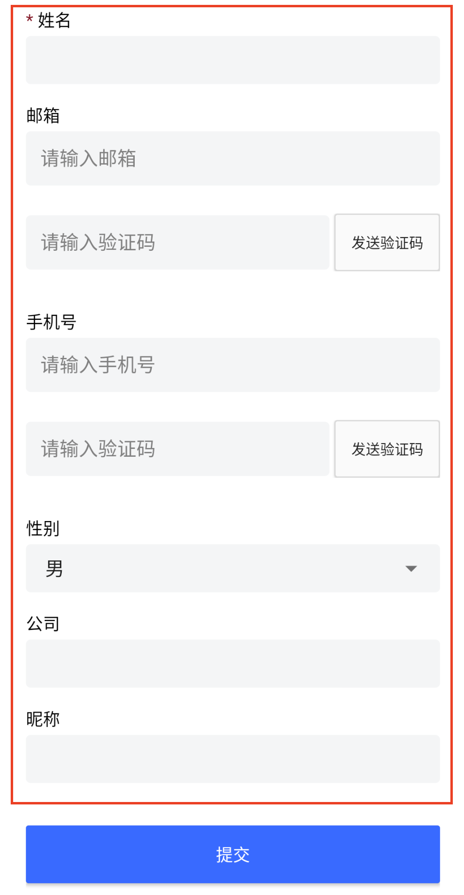

# 用户信息完善容器 UserInfoCompleteContainer

## 布局文件使用方式

```xml
<cn.authing.guard.complete.UserInfoCompleteContainer
    android:layout_weight="1"
    android:layout_width="match_parent"
    android:layout_height="0dp" />
```

>由于字段数量是由控制台动态配置的，所以需要放到 ScrollView 里面

<br>

## 效果如下



红色框里面为该控件区域。每一个字段是一个 [UserInfoFieldForm](./hc_complete_form.md)
