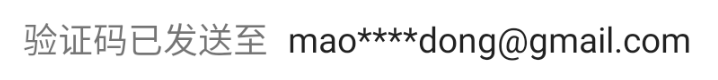

# 邮件标签 EmailLabel

继承至 [MaskLabel](./hc_mask_label.md)

## 布局文件使用方式

```xml
<cn.authing.guard.EmailLabel
    android:layout_width="wrap_content"
    android:layout_height="wrap_content"/>
```

<br>

## 效果如下



<br>

该控件会自动查找并显示当前 AuthFlow 里面的邮箱地址
