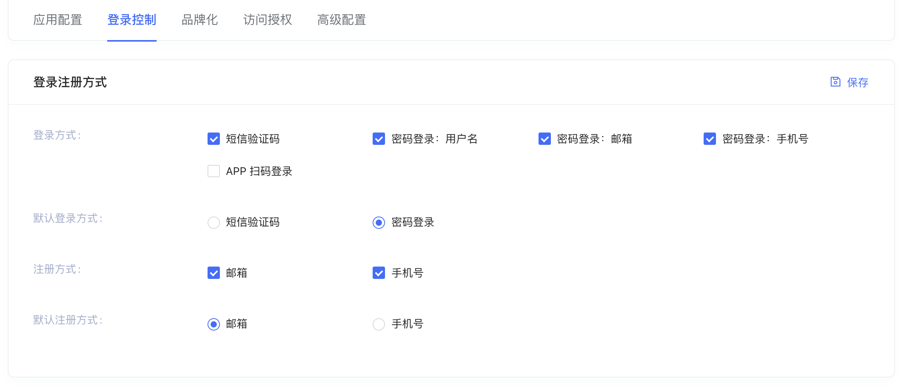

# 登录方法切换器 LoginMethodTab

## 布局文件使用方式

```xml
<cn.authing.guard.LoginMethodTab
    android:layout_width="match_parent"
    android:layout_height="52dp" />
```

## 效果如下


### 特性：

根据 Authing 后台登录方式的配置动态显示登录方法。同时将 “默认登录方式” 放到最左边。



>注意：切换的时候，该控件会遍历查找 [LoginContainer](./hc_login_container.md) 来完成切换。如果开发者未使用 LoginContainer，则需要自行处理登录方式的切换

<br>
