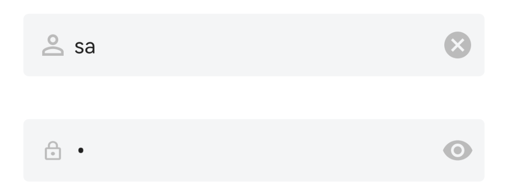

# 注册容器 RegisterContainer

## 布局文件使用方式

```xml
<cn.authing.guard.RegisterContainer
    app:type="accountPassword"
    android:layout_width="match_parent"
    android:layout_height="wrap_content">
    <cn.authing.guard.AccountEditText
        app:leftIconDrawable="@drawable/ic_authing_user"
        android:layout_width="match_parent"
        android:layout_height="wrap_content"/>
    <cn.authing.guard.PasswordEditText
        android:layout_width="match_parent"
        android:layout_height="wrap_content"
        app:leftIconDrawable="@drawable/ic_authing_password"
        app:clearAllEnabled="false"
        android:layout_marginTop="32dp"/>
</cn.authing.guard.RegisterContainer>
```

## 效果如下



### 特性：

使用 RegisterContainer 作为注册控件的容器，可以帮助 Guard 其他组件感知当前的状态。当注册操作被触发时，Guard 就可以自动获得必要信息完成注册操作。

如果不使用 RegisterContainer，则需要开发人员手动去监听事件以及手动获取输入框信息

<br>

## xml 属性列表

| 属性名                     | 类型 | 说明 | 默认值 |
| ----------------------- |:--------:| :------:| :-----: |
|  type     |    string    |  容器类型，取值范围：phoneCodePassword/emailPassword   |    phoneCodePassword   |

