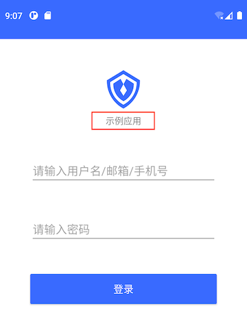

# 应用标题 AppName

## 布局文件使用方式
```xml
<cn.authing.guard.AppName
    android:layout_width="wrap_content"
    android:layout_height="wrap_content"/>
```

## 效果如下



### 特性：
* 根据 authing 后台设置，动态显示应用标题
* 继承至 TextView，拥有 TextView 所有特性

<br>
