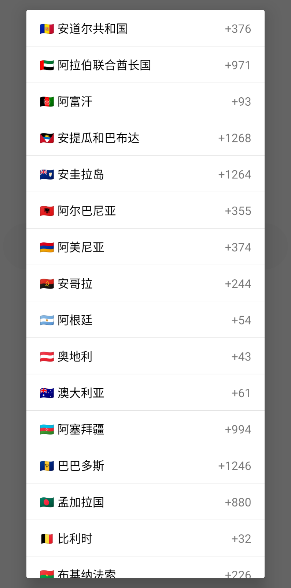

# 国家码选择器 CountryCodePicker

## 布局文件使用方式

```xml
<cn.authing.guard.CountryCodePicker
    android:id="@+id/ccp"
    android:layout_width="wrap_content"
    android:layout_height="match_parent"
    android:textSize="17sp"
    android:textColor="#888"
    app:showCountryName="true"
    app:showRightArrow="false"
    android:paddingLeft="24dp"/>
```

默认显示中国大陆。点击会弹出一个包含所有国家电话码列表的 Dialog，用户选择后会自动更新显示内容

## 效果如下


## 弹出对话框：



### 特性一：
可以通过 *showCountryName* 属性设置是否显示国家名称，如：
```xml
<n.authing.guard.CountryCodePicker
    app:showCountryName="true" />
```

<br>

### 特性二：
可以通过 *showRightArrow* 属性设置是否显示右边的箭头。如果不显示国家名称，建议显示箭头提示用户可以点击，如：
```xml
<n.authing.guard.CountryCodePicker
    app:showRightArrow="true" />
```

<br>

## xml 属性列表

| 属性名                     | 类型 | 说明 | 默认值 |
| ----------------------- |:--------:| :------:| :-----: |
|  showCountryName     |    boolean    |  是否显示国家名称   |    false   |
|  showRightArrow     |    boolean    |   是否显示右边的箭头   |    true   |

<br>

## API

**getCountry**

```java
public Country getCountry()
```

返回用户选择的国家对象，包含名称，简称，国家码。默认为中国大陆

使用示例：

```java
CountryCodePicker countryCodePicker = findViewById(R.id.ccp);
Country country = countryCodePicker.getCountry();
```
