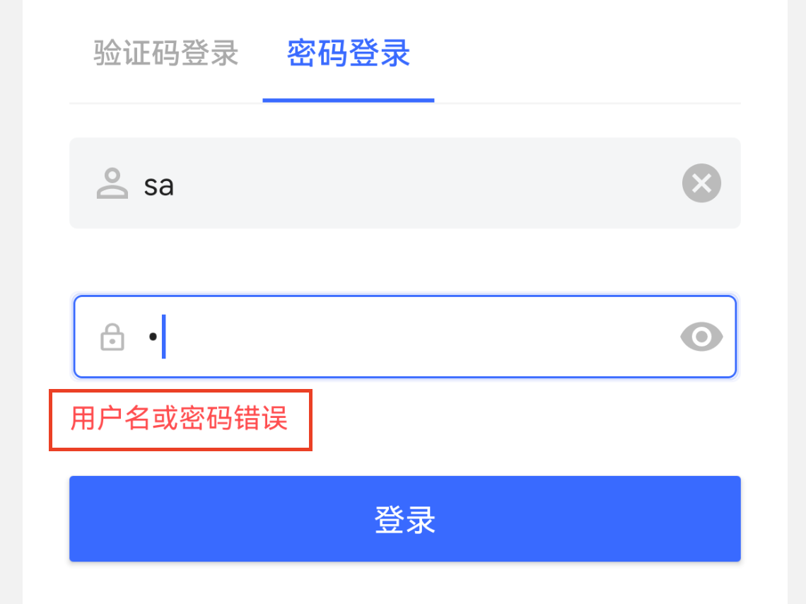

# 验证码输入框 ErrorTextView

## 布局文件使用方式

```xml
<cn.authing.guard.ErrorTextView
    android:id="@+id/tv_error"
    android:layout_width="0dp"
    android:layout_height="wrap_content"
    app:layout_constraintLeft_toLeftOf="parent"
    app:layout_constraintRight_toRightOf="parent"
    android:layout_marginStart="@dimen/authing_form_start_end_margin"
    android:layout_marginEnd="@dimen/authing_form_start_end_margin"
    android:layout_marginTop="8dp"/>
```

## 效果如下



### 特性：

继承至 TextView，具备 TextView 的所有能力。

当认证过程出现错误时，我们会遍历整个视图树，如果发现有 ErrorTextView 类型的 View，则会自动将错误信息设置给它。这样就可以省去开发者手动处理错误的工作量。

建议由 Guard 来处理错误，这样更符合标准，更安全。举个例子，安全要求不能显示 **“手机号不存在”** 这样的错误信息，因为黑客可以根据该错误信息去暴力破解哪些手机号是属于该系统的，然后利用这些信息去有针对性的发送短信。
