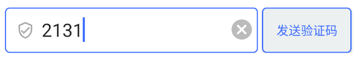
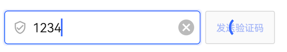

# 获取验证码按钮 GetVerifyCodeButton

## 布局文件使用方式

```xml
<cn.authing.guard.GetVerifyCodeButton
    android:id="@+id/btn_gvc"
    android:layout_width="wrap_content"
    android:layout_height="wrap_content" />
```

## 效果如下



### 特性：
点击发送验证码后

* 点击发送验证码后，播放加载动画
* 点击发送验证码后，按钮禁用
* 发送成功后进入倒计时
* 发送失败，若存在 ErrorTextView 类型的控件，将错误信息传给它


<br>



<br>


