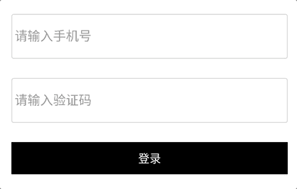

# 密码输入框 PasswordEditText

## 布局文件使用方式

```xml
<cn.authing.guard.PasswordEditText
    android:layout_width="match_parent"
    android:layout_height="wrap_content" />
```

## 效果如下


<br>

### 特性一：
提示语支持以下模式：

* *normal* 当用户输入时，提示语消失；当输入框没有内容时，提示语显示。
* *animated* 当输入框获得焦点时，提示语移动至顶部；当失去焦点时，提示语移动至输入框内。



可以通过 *hint_mode* 属性来控制，如：
```xml
<cn.authing.guard.PasswordEditText
    app:hintMode="animated" />
```

<br>

### 特性二：
根据 authing 后台设置，校验密码强度。

<br>

### 特性三：
可以通过 *toggleEnabled* 来显示/隐藏密码明文

<br>

### 特性四：
开发者可以通过获取内部的原生 EditText 对象来完成任意原生操作：

```java
PasswordEditText passwordEditText = findViewById(R.id.aet);
EditText editText = passwordEditText.getEditText();
```

<br>

## xml 属性列表

| 属性名                     | 类型 | 说明 | 默认值 |
| ----------------------- |:--------:| :------:| :-----: |
|  hintMode     |    string    |  normal/animated   |    normal   |
|  leftIconDrawable     |    reference    |   输入框左边图标   |    @drawable/ic_authing_password   |
|  toggleEnabled     |    boolean    |   当值为 true 且输入框有内容时，<br>输入框右侧会出现一个显示/隐藏密码明文的按钮   |    true   |
