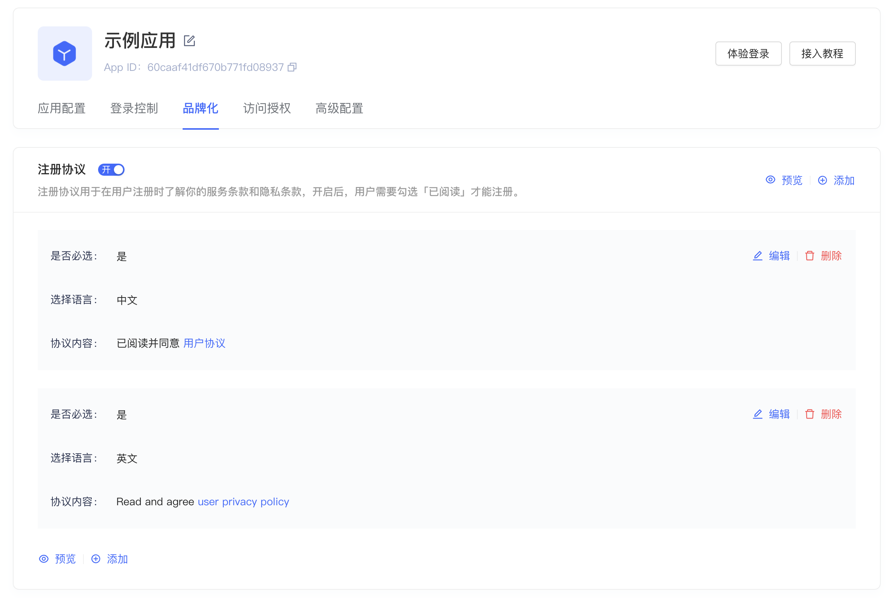

# 隐私确认框 PrivacyConfirmBox

## 布局文件使用方式

```xml
<cn.authing.guard.PrivacyConfirmBox
    android:layout_width="match_parent"
    android:layout_height="wrap_content" />
```

## 效果如下


<br>

### 特性一：
根据 Authing 后台配置动态显示内容。使用系统浏览器打开超链接



<br>

### 特性二：
当后台设置为“必选”时，如果用户在未勾选的情况下去尝试登录，则播放抖动动画：


<br>
