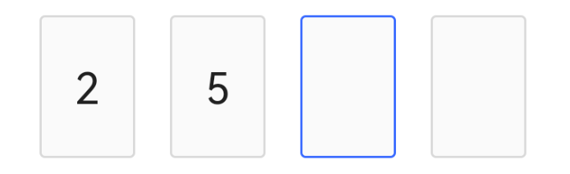

# 验证码输入框 VerifyCodeEditText

## 布局文件使用方式

```xml
<cn.authing.guard.VerifyCodeEditText
    android:layout_width="match_parent"
    android:layout_height="wrap_content" />
```

## 效果如下


<br>

### 特性一：
提示语支持以下模式：

* *normal* 当用户输入时，提示语消失；当输入框没有内容时，提示语显示。
* *animated* 当输入框获得焦点时，提示语移动至顶部；当失去焦点时，提示语移动至输入框内。


可以通过 *hint_mode* 属性来控制，如：
```xml
<cn.authing.guard.VerifyCodeEditText
    app:hintMode="animated" />
```

<br>

### 特性二：

通过属性 *codeMode*，支持常见的三种显示模式：

* *normal* 正常输入模式，如上图
* *frame* 矩形边框输入模式，焦点会随着用户输入自动往后移：



* *underLine* 下划线输入模式，焦点会随着用户输入自动往后移：


<br>

### 特性三：

frame 和 underLine 模式都会根据 authing 后台配置动态改变长度

<br>

### 特性四：

frame 和 underLine 模式下，可以通过 boxWidth，boxHeight，boxSpacing 属性来控制显示大小和间距。

>注意：上下左右均无 padding。若需要 padding，用 android:padding* 即可。

<br>

### 特性五：
根据 Authing 后台配置的验证码位数，限制验证码输入长度。当用户输入了指定长度的内容时，自动触发登录。

<br>

## xml 属性列表

| 属性名                     | 类型 | 说明 | 默认值 |
| ----------------------- |:--------:| :------:| :-----: |
|  hintMode     |    string    |  normal/animated   |    normal   |
|  leftIconDrawable     |    reference    |   输入框左边图标   |    @drawable/ic_authing_user   |
|  codeMode     |    string    |  normal/frame/underLine   |    normal   |
|  boxWidth     |    string    |  frame/underLine 模式下单个输入框的宽   |    128 px   |
|  boxHeight     |    string    |  frame/underLine 模式下单个输入框的高   |    150 px   |
|  boxSpacing     |    string    |  frame/underLine 模式下两个输入框之间的间距   |    48 px   |
