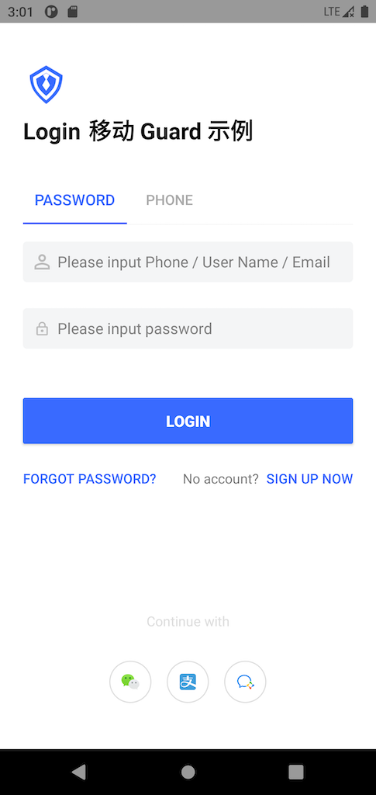

# Authing Android Guard

Authing guard is a UI component library for identity applications. It provides semanticalized hyper components for fast integration with Authing IDaaS service.

<br>

## Quick Start

1. Add dependency

```groovy
implementation 'cn.authing:guard:+'
```

2. Start guard：

```java
Authing.init(this, "your_authing_app_id"); // 'this' is your Application or initial activity
```

3. When authentication is required, start auth flow via:

```java
AuthFlow.start(this); // 'this' is current activity
```

this will show Authing style UI：



4. Receive authenticated user info in onActivityResult:

```java
@Override
protected void onActivityResult(int requestCode, int resultCode, @Nullable Intent data) {
    super.onActivityResult(requestCode, resultCode, data);
    if (requestCode == RC_LOGIN && resultCode == OK && data != null) {
        Intent intent = new Intent(this, MainActivity.class);
        UserInfo userInfo = (UserInfo) data.getSerializableExtra("user");
        intent.putExtra("user", userInfo);
        startActivity(intent);
    }
}
```

If custom UI is required, first write layout for every page, then simply replace step 3 by:

```java
// replace layouts with your customized layouts
AuthFlow.start(this, R.layout.activity_login_authing)
        .setRegisterLayoutId(R.layout.activity_register_authing)
        .setForgotPasswordLayoutId(R.layout.activity_authing_forgot_password)
        .setResetPasswordByEmailLayoutId(R.layout.activity_authing_reset_password_by_email)
        .setResetPasswordByPhoneLayoutId(R.layout.activity_authing_reset_password_by_phone);
```

That's all the code required because internally Guard uses a technique called semantic programming, which enables declarative programming on client side.

<br>
