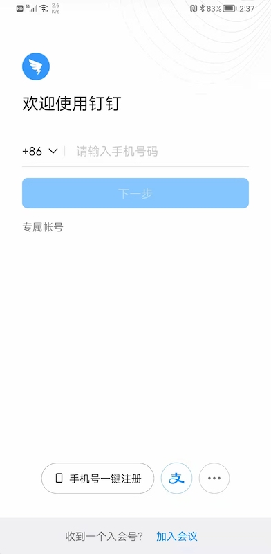
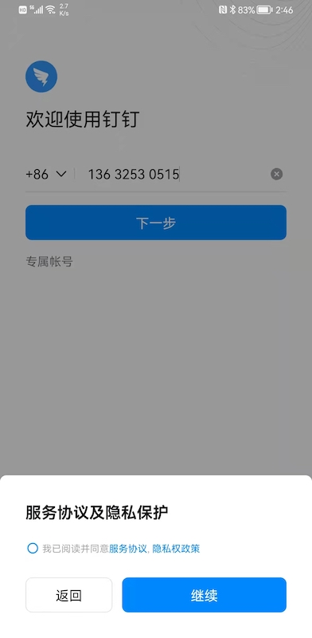
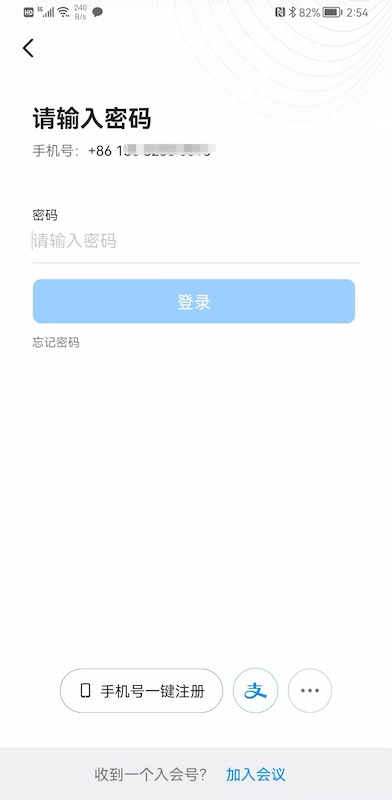
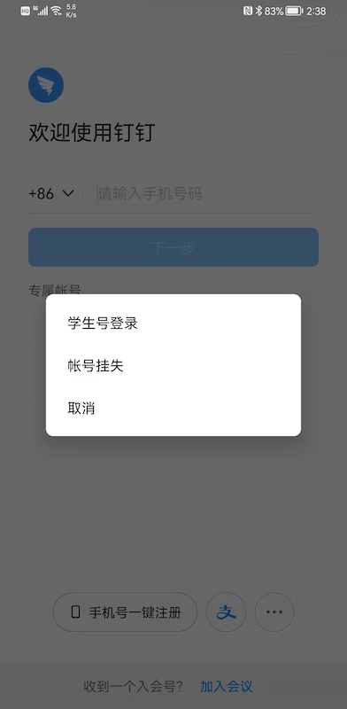
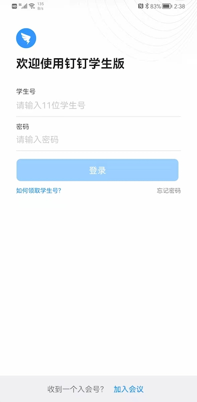

# 钉钉认证流程 & UI 分析

钉钉支持以下登录方式：

* 手机号+密码
* 手机号一键登录
* 支付宝登录
* 学生号+密码
* 专属帐号

 

## 使用手机号登录

钉钉和抖音、微信一样，也采用了分段式登录，其优点以及如何使用 Authing Guard 组件加速开发的相关说明请参考 [微信报告](./wechat.md)

截图如下：

该界面推荐使用以下 Guard 组件：

[CountryCodePicker](./../hc_country_code_picker.md)

[PhoneNumberEditText](./../hc_phone_number_edit_text.md)

 

当用户输入了合法的手机号后，点击“下一步”，会来到：

这里是钉钉和其他 App 不同的地方。一般 App 会将隐私确认放到登录首页，而钉钉将该操作独立出来了。可以通过隐私组件实现：

[PrivacyConfirmBox](./doc/hc_privacy_confirm_box.md)

同意隐私协议之后，就可以输入密码登录了：

这里注意钉钉在输入框顶部放了一个一直可见的提示语。一些 [表单设计文章](https://www.goavega.com/doing-form-design-heres-the-definitive-guide/) 推荐这种方式

 

## 手机号一键登录

很多 App 都支持的方式，需要付费给运营商或者云厂商。可以参考 [抖音报告](./douyin.md) 以及 Authing 专题：[手机号一键登录](./../topics/onepass.md)

 

## 支付宝登录

跳转到支付宝登录，Authing 提供的第三方登录聚合能力包含支付宝登录。参考 [社会化登录](./../social.md)

 

## 学生号+密码

一种钉钉特有模式，在首页点击 "..." 按钮会弹出一个对话框：

选择学生号登录：

 

## 专属帐号

在 2E/2B 认证场景里面，绝大部分企业都已经有存量帐号系统，一般是工号+密码的认证方式。所以 OA 系统为了能兼容这种模式，也提供专属帐号登录。其原理就是一个典型的 OAuth 认证过程。钉钉会跳转到企业的登录界面完成登录，或者企业提供 REST API 供钉钉调用，完成专属帐号认证。认证通过后，专属帐号系统授权给钉钉使用，钉钉拿到帐号信息到专属帐号后台校验合法性，如果合法则颁发钉钉本身的凭证。

这种方式的好处包括：

* 用户只需要记住一套用户名密码
* 可以通过配置来确保信息变更发生在一个地方。可以将钉钉作为帐号源，也可以将专属帐号系统作为帐号源。
* 可以快速和存量系统打通
* 一些企业员工不愿意提供电话号码，如第三方合作人员

Authing 支持满足标准协议的企业身份源。参考这里在后台进行必要的配置：[企业身份源配置](https://docs.authing.cn/v2/connections/oidc/?step=0)

面向 App 开发者，我们提供两种解决方案：

1. 通过我们的组件定义一个登录界面，然后根据标准协议（OIDC，OAuth，SAML，CAS）规范，用原生的方式去调用企业自己 IdP 提供的接口
2. 通过 WebView 唤起企业自己的登录界面，完成登录后将认证信息通过 JS 桥接传回原生