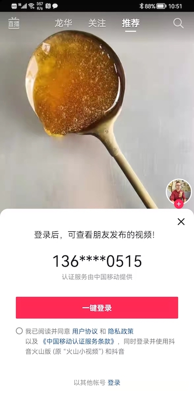
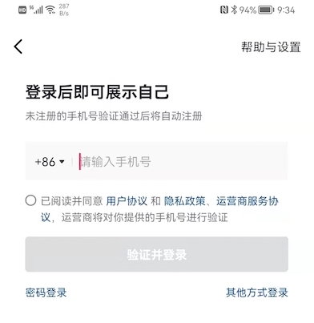
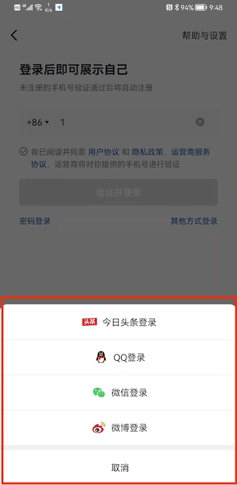
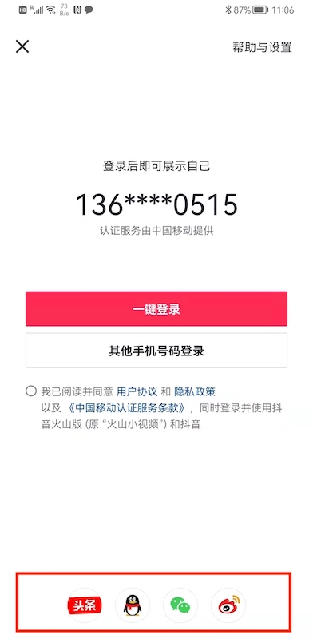

# 抖音认证流程 & UI 分析

抖音支持以下登录方式：

* 手机号一键登录
* 手机号+验证码
* 第三方登录
* 手机号+密码

<br>

## 手机号一键登录

几乎所有头部 App 默认都采用这种方式。相对于传统的用户名+密码，手机号+验证码，该方式用户体验最好。

截图如下：


该方式还有一种用法，就是一开始不要求登录，等用户使用一段时间后，通过弹窗的方式请求登录。这时用户只需点一下按钮就能登录：



如果已经登录过，则显示为用户名：


这些细节都不需要开发人员操心，可以通过 Authing Guard 组件快速实现

注意第二个按钮“其他手机号码登录”。这里有两层含义：

* 抖音只接受手机号码登录，不支持用户名/邮箱作为帐号名。这只需要在 Authing 控制台简单勾选，再配合 Guard 组件就能实现：


* 手机号一键登录的一个不足在于，它只能获取当前正在使用的 SIM 卡的电话号码。当用户有双卡双待，或者想用任意手机号登录时，则不能使用该方法，这就要求 App 还必须得支持传统的登录方式。也就是说，为了更快获客而发明的手机号一键登录方式虽然从业务角度大幅提高了用户体验，但由于其不能涵盖所有场景，App 开发团队还得开发/维护传统登录方式。从开发角度，是增加了工作量。

目前接入该方式都是需要收费的，配置也很麻烦。Authing 为此做了大量工作，将开发者的工作量降到最低。

更多详情参考 Authing 专题：[手机号一键登录](./../topics/onepass.md)

<br>

## 手机号+验证码登录



在另外一个界面输入验证码


抖音和微信一样，也采用了分段式登录，其优点以及如何使用 Authing Guard 组件加速开发的相关说明请参考 [微信报告](./wechat.md)

这里有一行小字：未注册的手机号验证通过后将自动注册。

```java
// 开始作者胡思乱想，不代表 Authing 观点

是不是说，即使用户不输入验证码，在抖音后台也为其创建一个帐号，并开始运用所有推荐算法，只是在端侧表现为未登录状态，无法查看个人数据。

// 结束作者胡思乱想，不代表 Authing 观点
```

<br>

## 第三方登录

微信是没有第三方登录的，微信本身就是一个第三方登录源。抖音既可以用第三方登录，也可以将自己作为认证源。

第三方登录的开发是一项艰难的过程，步骤非常繁琐，业界有一些端侧聚集 SDK。Authing 作为认证领域专家，除了提供最基本的端侧聚集 SDK，配合上本身强大的身份中台以及简便的管理控制台，可以帮助开发者极速构建第三方登录能力。





红色部分推荐使用：

[SocialLoginListView](./../components/hc_social_login_list_view.md)


所以用户期望点击微信后能跳转到微信，点一下“确认”就能登录抖音？事情没有那么简单。对一些流量较小的 App，可能会将微信的 OpenID（或者 UnionID）作为自己的用户标识，但抖音以及众多流量较大的 App 不会，他们仍然会要求用户绑定用户手机号。理由是：


用户需要手动点击“绑定”


好消息是，只需要绑定一次，也就是说，如果用户登出抖音，再次用微信登录抖音就不需要绑定手机号了

<br>

## 手机号+密码登录

经典登录方式：


推荐使用以下控件：

[PhoneNumberEditText](./../components/hc_phone_number_edit_text.md)

[PasswordEditText](./../components/hc_password_edit_text.md)

[PrivacyConfirmBox](./../components/hc_privacy_confirm_box.md)

[LoginButton](./../components/hc_login_button.md)
