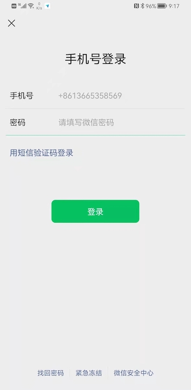

# 微信认证流程 & UI 分析

微信支持以下登录方式：

* 手机号+验证码
* 手机号+密码
* 账号+密码 （这里的账号**包括**微信号、QQ号、邮箱，**不包括**电话）

 

## 使用手机号登录

微信默认使用手机号登录。交互采用分段式，而不是在一个界面同时显示两个输入框。这样的设计有以下好处：
* 用户可以聚焦一件事情
* 可以先对手机号的合法性进行校验
* 手机登录分为 *手机号+验证码*、*手机号+密码*。这两种模式的切换可以放到下一个页面

截图如下：

要开发这样的界面，主要工作量包括：
* 实现国家码选择控件
* 对用户输入的手机号进行合法性校验
* 一些繁琐的小细节，如提示语的位置、根据输入显示/隐藏全部消除按钮、输入类型设置为数字等

好消息是，Authing Guard 解决了上面问题。

请参考：

[CountryCodePicker](./../components/hc_country_code_picker.md)

[PhoneNumberEditText](./../components/hc_phone_number_edit_text.md)

 

当用户输入了合法的手机号后，点击“下一步”，会来到：

这里用户可以选择使用密码或者验证码进行登录。若选择密码，可以使用我们的密码输入控件：

[PasswordEditText](./../components/hc_password_edit_text.md)

若用户选择使用验证码登录，会来到：

实现验证码登录需要和云厂商对接，不仅非常耗时还需要付费。

可以通过我们提供的 [VerifyCodeEditText](./../components/hc_verify_code_edit_text.md) 控件来加速开发。该控件除了发送验证码，还提供一些细节（是的，都不是登月难度的科技，我们就是提供细致好用的控件帮开发者省时）：

* 当用户输入的数字达到验证码位数，自动触发登录
* 下次发送倒计时
* 非法输入提醒
* 将输入框模式设置为数字
* 超时提醒
* 是否触发 Captcha

 

## 使用账号密码登录

经典登录方式，如下图：

推荐使用以下控件：

[AccountEditText](./../components/hc_account_edit_text.md)

[PasswordEditText](./../components/hc_password_edit_text.md)

[LoginButton](./../components/hc_login_button.md)