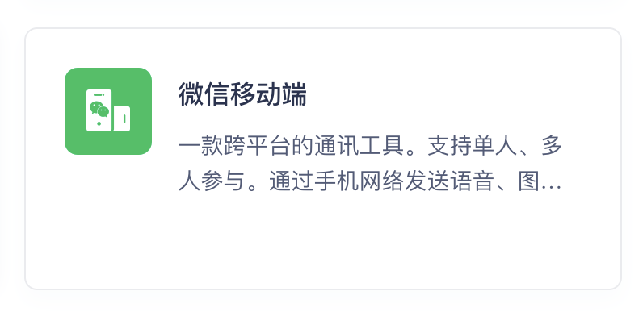
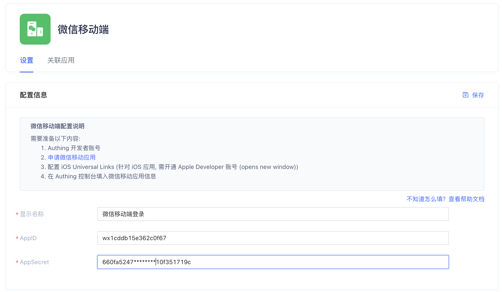
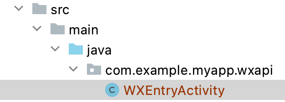

# 微信登录

集成微信需要三个主要步骤：
* 在微信开放平台进行配置
* 在 Authing 管理控制台进行配置
* 集成 Android SDK

<br>

## 在 [微信开放平台](https://open.weixin.qq.com/) 的操作步骤

>注意：使用微信登录需要开发人员在微信开放平台认证，需要是个体商户，企事业单位。不支持个人开发人员，当前认证费用为 300 RMB

1. 获取 AppID 和 AppSecret


2. 设置 Android 应用信息


> 特别注意：这里的签名 MD5 不能包含冒号

<br>

## 在 Authing 管理控制台的操作步骤

1. 在控制台的 “连接身份源” 菜单选择 “创建社交身份源“


2. 选择 “微信移动端”



3. 填入微信开放平台对应的 AppID 和 AppSecret



<br>

## 集成 Android SDK 步骤

1. 设置依赖：
```groovy
implementation 'cn.authing:guard:+'
implementation 'com.tencent.mm.opensdk:wechat-sdk-android:6.8.0'
```

>Guard 只是 compileOnly 依赖微信，这样可以让 App 按需引入，防止 Guard aar 包随着支持的第三方登录增加而越来越大。所以每增加一个第三方身份源，都需要 App 手动加上该身份源的依赖

2. 在应用启动的时候设置微信 AppID：
```java
Wechat.appId = "wx1cddb15e280c0f67";
```

3. 在应用启动的时候初始化 Authing：
```java
// appId 是 authing 的应用 id，可以在 authing 控制台里面获取
Authing.init(context, appId);
```

4. 由于微信的限制，必须在应用包名所在的目录下创建一个 wxapi/WXEntryActivity。假设你的应用包名为：

com.example.myapp

则需要按照如下方式创建：



其内容只需要继承我们的实现类：

```java
package com.example.myapp.wxapi;

import cn.authing.guard.social.wechat.WXCallbackActivity;

public class WXEntryActivity extends WXCallbackActivity {
}
```

5. 在 Manifest 里面声明微信回调 Activity

```xml
<activity
    android:name=".wxapi.WXEntryActivity"
    android:exported="true" />
```

接下来，如果使用我们提供的微信登录按钮，则在布局文件里面加上（当然也可以用代码初始化）：

```xml
<cn.authing.guard.WechatLoginButton
    android:id="@+id/btn_wechat_login"
    android:layout_width="44dp"
    android:layout_height="44dp"
    app:layout_constraintLeft_toLeftOf="parent"
    app:layout_constraintRight_toRightOf="parent"/>
```

然后在 java 代码里面处理事件：

```java
WechatLoginButton button = findViewById(R.id.btn_wechat_login);
button.setOnLoginListener((ok, data) -> {
    if (ok) {
        // 登录成功，data 是用户信息
    } else {
        // 登录失败
    }
});
```

<br>

如果不想使用我们内置的按钮，则可以在自己按钮的点击事件里面调用 Authing 微信登录 API：

```java
Wechat.login(appContext, ((ok, data) -> {
    if (ok) {
        // 登录成功，data 是用户信息
    } else {
        // 登录失败
    }
}));
```