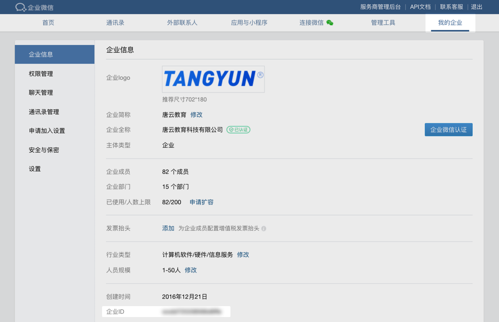
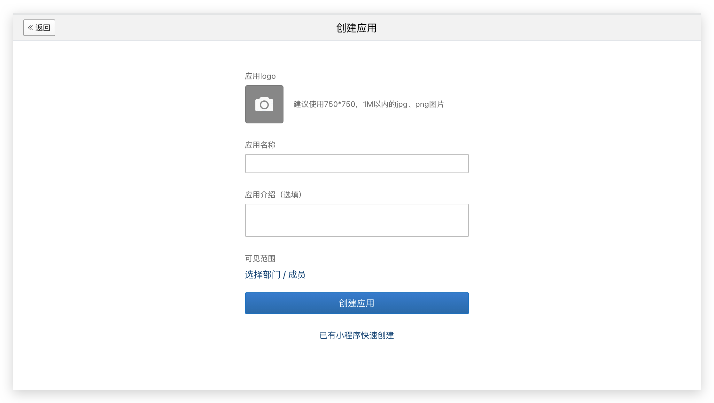
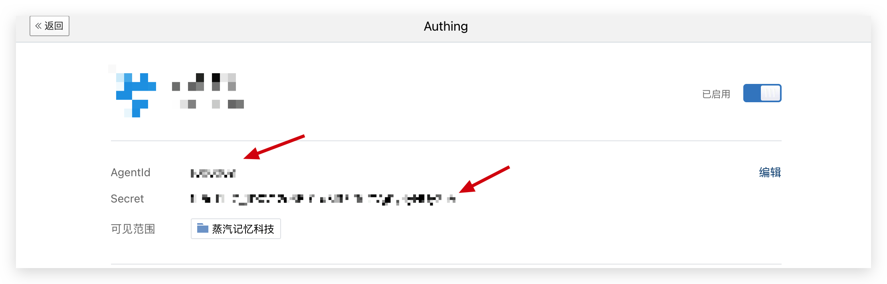
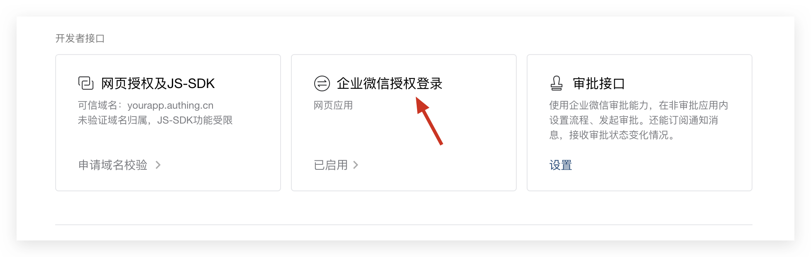
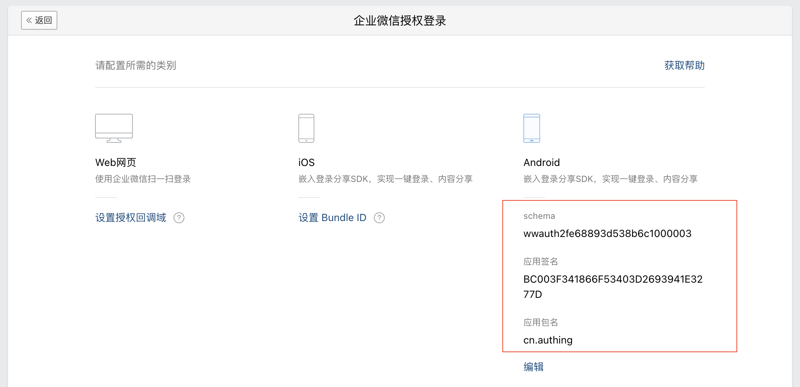

# 企业微信登录

集成企业微信需要三个主要步骤：
* 在企业微信管理控制台进行配置
* 在 Authing 管理控制台进行配置
* 集成 Android SDK

<br>

## 在企业微信管理控制台的操作步骤
1. 获取企业 ID（CorpID）



2. 获取 AgentID 和 Secret

你需要先在 [应用管理 - 应用管理](https://work.weixin.qq.com/wework_admin/frame#apps) 创建一个自建应用



创建完成之后，你可以获取该应用的 AgentId 和 Secret：



3. 启用企业微信授权登录

在应用详情页，点击设置企业微信授权登录：



启用之后，再次点击 “已启用” 按钮，进入配置界面，填入 App 签名的 MD5 码和包名：



> 特别注意：这里的签名 MD5 不能包含冒号

<br>

## 在 Authing 管理控制台的操作步骤

<br>

## 集成 Android SDK 步骤

1. 下载 <a href="attachment/wechatwork.jar" target="_blank">企业微信 SDK</a>，并将 jar 包拷贝到工程的 libs 文件夹下面
2. 设置依赖：
```groovy
implementation 'cn.authing:guard:+'
implementation files('libs/wechatwork.jar')
```

3. 在应用启动的时候设置微信 AppID：
```java
WeCom.corpId = "ww2fe68893d538b6c1";
WeCom.agentId = "1000003";
WeCom.schema = "wwauth2fe68893d538b6c1000003";
```

4. 在应用启动的时候初始化：
```java
// appId 是 authing 的应用 id，可以在 authing 控制台里面获取
Authing.init(context, appId);
```

接下来，如果使用我们提供的企业微信登录按钮，则在布局文件里面加上（当然也可以用代码初始化）：

```xml
<cn.authing.guard.WeComLoginButton
    android:id="@+id/btn_wecom_login"
    android:layout_width="44dp"
    android:layout_height="44dp"
    app:layout_constraintLeft_toLeftOf="parent"
    app:layout_constraintRight_toRightOf="parent"/>
```

然后在 java 代码里面处理事件：

```java
WeComLoginButton button = findViewById(R.id.btn_wecom_login);
button.setOnLoginListener((ok, data) -> {
    if (ok) {
        // 登录成功，data 是用户信息，里面有 accessToken
    } else {
        // 登录失败
    }
});
```

<br>

如果不想使用我们内置的按钮，则可以在自己按钮的点击事件里面调用 Authing 企业微信登录 API：
```java
WeCom.login(appContext, ((ok, data) -> {
    if (ok) {
        // 登录成功，data 是用户信息，里面有 accessToken
    } else {
        // 登录失败
    }
}));
```