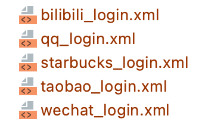

# 使用模板接入

Guard 组件，预置了 10+ 基于业务（行业）的登录/注册界面模板。开发者只需要选择自己的行业，拷贝对应的模板，即可在 10 分钟内实现复杂的，完整的认证流程。

步骤一：添加依赖

``` gradle
implementation 'cn.authing:guard:+'
```

步骤二：在本项目的 app/src/main/res/layout 目录下选择适合自己 App 的模板布局文件，如：



步骤三：在应用启动的时候，如 Application 的 onCreate 方法，调用：

```java
Authing.init(appContext, "your_authing_app_id");
```

步骤四：在自己项目的登录 Activity 里面加载对应布局模板文件

```java
@Override
protected void onCreate(Bundle savedInstanceState) {
    super.onCreate(savedInstanceState);
    setContentView(R.layout.starbucks_login);
}
```

<br>