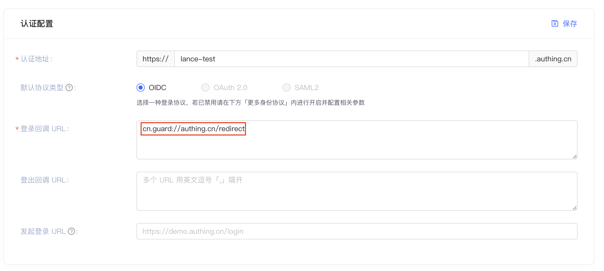
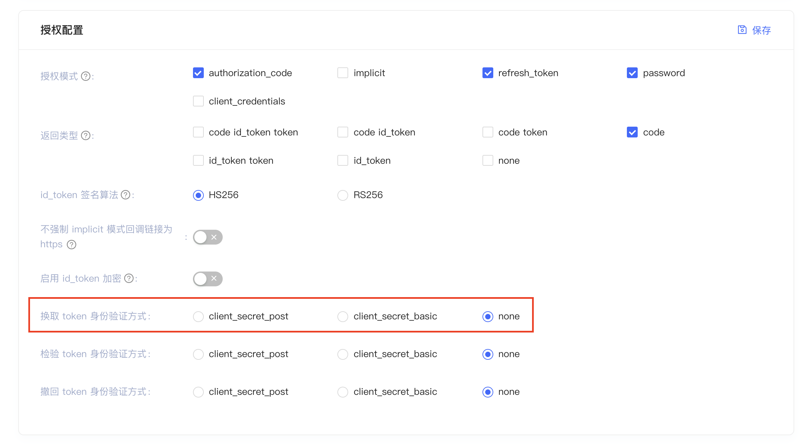

# 使用 Authing WebView 接入

使用 WebView 可以避免页面跳转

1. 在 Authing 后台配置回调，*只能为*：https://guard.authing/redirect



2. 设置换取 token 身份验证方式。由于我们是客户端，不能存放 client secret，所以需要



3.  添加依赖

``` gradle
implementation 'cn.authing:guard:+'
```

4.  在处理登录的布局文件里面使用我们封装的 WebAuthView：

```xml
<cn.authing.guard.WebAuthView
    android:id="@+id/wv_auth"
    android:layout_width="match_parent"
    android:layout_height="match_parent" />
```

5. 设置认证回调，获取 id token：

```java
public class AuthingWebViewActivity extends BaseLoginActivity {

    WebAuthView webView;

    @Override
    protected void onCreate(Bundle savedInstanceState) {
        super.onCreate(savedInstanceState);
        setContentView(R.layout.activity_authing_web_view);
        webView = findViewById(R.id.wv_auth);
        webView.setOnLoginCallback(this::setResult);
    }

    private void setResult(UserInfo userInfo) {
        runOnUiThread(()->{
            if (userInfo != null)
                // userInfo.getIdToken()
            else
                // Auth failed
        });
    }
}
```