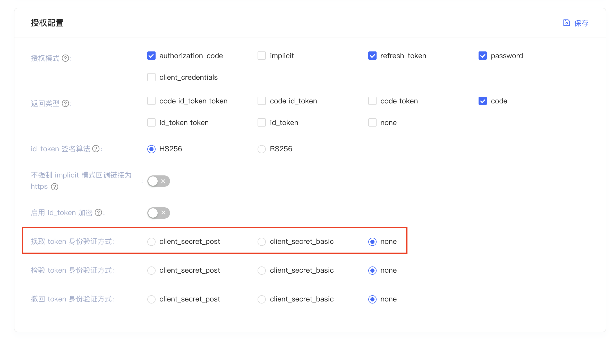

# 使用 AppAuth 接入 Authing

AppAuth 是一个实现了 OAuth、OIDC 协议的移动库。它通过打开系统浏览器进入身份提供商的托管页面完成认证，使用 AppAuth 可以快速完成认证。

AppAuth 和原生的对比如下：

|                      | AppAuth | 原生 | 说明 |
| -------------------- |:--------:| :------:| :------:| 
| 用户体验     |    差    |  好   |    AppAuth 会打开系统浏览器，完成认证后，在回到 App 的过程中系统会弹窗提示用户是否用原生应用打开   |
|  性能     |    差    |   好   |    AppAuth 每次都需要加载页面，即使已经认证过，也要弹出再弹回。（可以用原生代码规避，如手动保存登录状态）   |
|  开发难度     |    低    |  Depends   |    因为复杂的 UI 由身份提供商 Web 页面实现，所以不用开发 UI。但既然应用采用了 AppAuth，表明应用可以接受身份提供商 UI，那么也可以通过原生快速接入：[使用 Authing 原生 UI 极速接入](./../start_with_authing.md)   |
|  升级难度     |    低    |  高   |    需要 App 升级   |
|  掌控度     |    低    |  高   |    AppAuth 方式，UI以及认证流程主要由身份供应商定义；原生模式则完全由开发人员掌控   |


<br>

接下来介绍接入流程，分为配置部分和代码部分

<br>

# 配置步骤如下：

## 1. 引入依赖

```groovy
implementation 'cn.authing:guard:+'
implementation 'net.openid:appauth:0.10.0'
```

<br>

## 2. 在 AndroidManifest 里面配置如下：

```xml
<activity
    android:name="net.openid.appauth.RedirectUriReceiverActivity"
    tools:node="replace">
    <intent-filter>
        <action android:name="android.intent.action.VIEW"/>
        <category android:name="android.intent.category.DEFAULT"/>
        <category android:name="android.intent.category.BROWSABLE"/>
        <data android:scheme="https"
            android:host="guard.authing"
            android:path="/redirect"/>
    </intent-filter>
</activity>
```

其中 android:host，android:path 由应用自定义。只要不和其他网站冲突就行

<br>

## 3. 在 Authing 后台配置回调

将上面步骤的的配置拼接为 URL 后配置到 Authing 的登录回调里面。在上面例子中，回调 URL 为：

https://guard.authing/redirect

那么我们需要在 authing 后台做如下配置：


## 4. 设置换取 token 身份验证方式

<br>

由于我们是客户端，不能存放 client secret，所以需要



<br>

# 代码：

## 1. 初始化

在应用启动（如 App.java）里面调用：

```java
Authing.init(appContext, "your_authing_app_id");
```

## 2. 获取 Authing 基础信息

在 App 启动界面，如闪屏，调用：

```java
Authing.requestPublicConfig((ok, data) -> continue_your_app_flow());
```

## 3. 获取 Authing 端点信息

```java
Config config = Authing.getPublicConfig();
String host = config.getIdentifier();
AuthorizationServiceConfiguration.fetchFromIssuer(Uri.parse("https://" + host + ".authing.cn/oidc"),
        (serviceConfiguration, ex) -> {
            if (ex != null) {
                Log.e(TAG, "failed to fetch configuration");
                return;
            }

            startAuth(serviceConfiguration);
        });
```

## 4. 用系统浏览打开认证界面

```java
AuthorizationRequest.Builder authRequestBuilder =
        new AuthorizationRequest.Builder(
                serviceConfig, // the authorization service configuration
                Authing.getAppId(), // the client ID, typically pre-registered and static
                ResponseTypeValues.CODE, // the response_type value: we want a code
                Uri.parse("https://guard.authing/redirect")); // the redirect URI to which the auth response is sent

AuthorizationRequest authRequest = authRequestBuilder
        .setScope("openid profile email phone address")
        .build();

AuthorizationService authService = new AuthorizationService(this);
Intent authIntent = authService.getAuthorizationRequestIntent(authRequest);
startActivityForResult(authIntent, 1000);
```

>注意：这里的 "https://guard.authing/redirect" 即上面配置信息里面的回调地址，确保已在 authing 后台配置

## 5. 拿到凭证

```java
@Override
protected void onActivityResult(int requestCode, int resultCode, Intent data) {
    super.onActivityResult(requestCode, resultCode, data);
    if (requestCode == 1000) {
        AuthorizationResponse resp = AuthorizationResponse.fromIntent(data);
        AuthorizationException ex = AuthorizationException.fromIntent(data);
        // ... process the response or exception ...

        authService.performTokenRequest(
                resp.createTokenExchangeRequest(),
                (resp1, ex1) -> {
                    if (resp1 != null) {
                        // exchange succeeded resp1.idToken
                    } else {
                        // authorization failed, check ex for more details
                    }
                });
    } else {
        // ...
    }
}
```

更多详情参考 Demo 里面的 AppAuthActivity.java