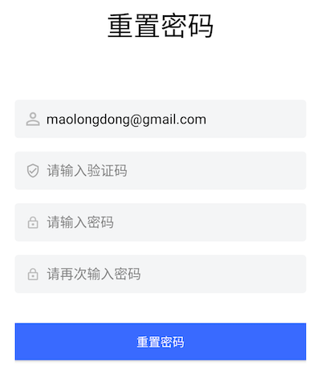

# 基于语义化思想的全新编程模型

## 什么是语义化

语义化是指将抽象的事物具象化当前语境下的过程。有几种语义化类型：

* 方式一：将一个概念放到上下文里面。比如猪是一个抽象的概念，放到动画片里面就是佩奇，放到中餐厅就是红烧肉，放到西餐厅就是烤肠。
* 方式二：在特定的业务场景里面，用子类型代替父类型。比如我们可以说“在山区里，我们看到了几只**山羊**在玩攀岩”，但当我们说”薅羊毛“的时候，我们几乎总是指绵羊。
* 方式三：为了满足一个特定需求，基于某个已有概念，创造出一个全新的类型。比如：

```java
class AnimatedDrawable extends Drawable
```

Drawable 是一种类型，用来表示任何可以被画出来的事物。而 AnimatedDrawable 是那些可以包含动画的 Drawable。
我们在现实生活中，几乎不会有人讨论 Drawable 和 AnimatedDrawable，他们只存在于计算机里面，某种意义上的元宇宙居民。

那到底是抽象的好，还是具体的好呢？

比较确定的一点是：在给定的一个业务场景下，肯定是具体的好。甚至，即使程序员打算使用抽象的工具，也必须将其具体化（在编程里面我们叫做实例化），否则业务就无法实现。比如我们的需求是在屏幕上显示一个图片，在主流的平台上，多半会这样写：

```java
Image image = new Image("x.png");
```

或者：

```java
Image image = SomeImageOrBitmapFactory.createImage("x.png");
```

在 createImage 内部，还是会创建一个 Image 实例。

然而在 C 语言里面，我们可以这样写：

```c
unsigned byte* data = loadImage("x.png");
```

那么问题来了，哪种好？这个问题其实就是高级语言 vs 底层语言的问题。

实际上，**编程语言本身也一种语义化**，计算机只认识高电压和低电压，是的，它们甚至对 0 和 1 都一无所知。当布尔发明 0 和 1 的时候，就迈出了语义化的第一步。对人类来说，数字也是描述物理世界的一种语义。后来的故事大家都听说了，我们觉得写很多 0 和 1 不够语义化，于是我们发明了 MOV，JUMP 这样的指令。如果将低电压/高电压用 0 和 1 表示是否称作语义化还有争议，那么 MOV，JUMP 的出现就非常明确了计算机编程语言发展的方向就是**语义化**。紧接着就是高级语言如 C 的出现以及面向对象语言如 SmallTalk，Java 的出现。程序员（英语国家老外）可以像写说明文一样写程序。

所以回答上面的问题，从开发效率角度上看，面向对象的写法比 C 语言写法更容易理解，更好维护。越底层语言的优势是运行效率更高。实际情况是，很多业务在今天都不太需要考虑本地运行效率问题，问题主要在开发效率上。

既然在给定的业务场景里面无论如何我们都要具像化，那为什么我们还要面对 int，String，Button，Image 这些抽象概念呢？我仔细看过原型图了，我这里要的是一个：

TwoPixelRoundedCornerWithTextOf_GOTOMARS_WithRedColorWith10LeftPaddingAndWhenClickedCall_Gotomars_FunctionButton

我不理解，苹果为什么不在 SDK 里面提供一个这样的 Button

很显然，苹果这辈子都不可能提供这样的 Button。它只会提供 Button 类型。实例化以及事件处理是程序员的事。

这里根本的冲突是：**编程语言以及平台 SDK 只提供了通用的组件和接口。**

不过相信大家也注意到，在一些特定业务场景，平台会提供更为具体的 SDK。比如在 Sign in with Apple 场景，苹果提供：

[ASAuthorizationAppleIDButton](https://developer.apple.com/design/human-interface-guidelines/sign-in-with-apple/overview/buttons/)

那语义化有没有缺点？缺点就是增加了概念，这让脑子里已经塞满了各种概念的程序员焦躁不安。

通过上面 Sign in with Apple 例子，我们意识到苹果创造出了一个新控件，这需要程序去了解，去学习。假设苹果提供的是一个 REST 请求地址，那我们就可以用已有知识自己构建这么一个按钮，即使用通用的 Button 加上通用的网络请求。

但我们认为，这种概念性的学习成本，在给定的业务场景里面是会被收益抵消的。因为程序员不管怎样都要学习这些概念。概念学习完后，与其自己花很多时间用 Button+REST 写，还不如直接用苹果提供的控件。对于那些想自己写的程序员，大概率是，最后自己封装了一个 SignInWithAppleButton，功能还不一定有苹果提供的 Button 完善。

回到我们认证领域，我们讨论的语义化是指将认证领域的编程元素具像化。这样更贴近最终业务，极大提高开发效率。这里的编程元素包括：UI、事件处理逻辑、流程。

我们能语义化是因为我们的场景是确切的。是的，我们会增加很多概念，但如上面讨论，这些概念在开发认证业务时，是无法忽略的。从长远来看，如果我们的概念是认证领域的通用标准，那程序员应该在大学时候就学习了这些概念，到了工作岗位上，他们应该能像使用 FileInputStream 这样的类一样熟练使用认证领域的标准控件和接口。毕竟，当前哪个业务不需要认证呢？

<br>

## 语义化编程模型

语义化编程有以下特点：

* 所有可交互组件语义化（Semanticalize all interactive widgets)
* 上下文感知（Context aware）
* 声明式编程（Declarative Programming）
* 数据实时同步（Realtime Data Syncing）
* 可嵌入（Embeddable）

接下来我们逐一介绍。

<br>

* **所有可交互组件语义化**

语义化编程的第一步是将所有可交互的组件语义化。我们将语义化后的组件称为 **Hyper-Component**。我们通过一个典型的认证流程来说明（以 Android 为例，其他平台类似）

 
 

这里的 “可交互” 包括：
1. 内容可以动态改变，如顶部的 Logo，它其实是可以在控制台配置的，所以它算是一个可交互的控件，需要被语义化。如 AppLogo
2. 用户可以操作。如按钮。虽然按钮的文字，背景都是固定的，但用户可以点击，所以它也算是可交互控件。

所以上面例子中的登录界面，包括“忘记密码”，“立即注册”这样的小按钮也需要被语义化为：ForgotPasswordButton, GoRegisterButton

哪些不是可交互的呢？如下面灰色的“第三方帐号登录”文字，就不是可交互的，这样的控件不需要语义化，可以用平台自带的通用控件实现。

如果不使用语义化思想，为了实现这样的一个功能，我们要完成以下步骤：

1. 为每个页面创建控制器（Android 里面叫做 Activity）
2. 为每个页面创建布局文件
3. 每个控制器指定加载对应的布局文件
4. 每个页面布局文件里面，创建 Android 系统的各种通用控件，如 Button，TextView，为每个控件设置样式属性
5. 在控制器里面找到可交互的控件（findViewById or DataBinding）
6. 为每个可交互的控件编写事件响应代码
7. 事件响应代码里面会涉及到调用后台接口，需要熟悉了解每个接口的定义
8. 处理页面跳转，将需要的字段从当前页面传入下一个页面，并在下一个页面写代码获取需要的字段
9. 实现一些控件的特殊交互效果。如当输入框获得焦点，输入框的提示语可能要飞到顶部；当用户点击了“发送验证码”时，需要转圈，验证码发送成功后，需要倒计时；如果用户不勾选隐私协议就去点击登录，需要让该控件播放抖动动画等等非常多的细节

这些都很繁琐。所以很自然的，我们需要封装一些 UI 控件实现其中的一些细节，市面上有一些第三方库封装了一些能力，如 Google 提供的 TextInputLayout 实现了提示语向上飞的动画；[国家码选择器](https://github.com/hbb20/CountryCodePickerProject) 提供国旗、国家电话前缀、国家简称的展示以及搜索等功能。还有一些 SaaS 厂商会提供带网络请求的业务组件，开发者不用写代码自己去调用后台。到这里，基本也就到头了。

然而事实上，这只是一个开端，我们发现即使使用了这些第三方库，还是有大量繁琐的，重复的工作要做。我们必须更进一步。

我们在语义化这条路上走得很远，语义化真正的力量是需要和下面几个思想相结合才能爆发出来。当然前提是，所有可交互的控件都已经被我们语义化了，不能有漏网之鱼。

<br>

* **上下文感知**

人类的思维模式是有上下文的，或者叫语境，中文尤其突出。尝试理解下面这句话：能穿多少穿多少。到底穿多还是穿少？放到上下文就清晰了：

北京冷，能穿多少穿多少

深圳热，能穿多少穿多少

所以当我们看到一个登录界面的时候，我们是不会看到 TextView，Input，Button 这些抽象物体的。因为我们已经有上下文了。所以很自然的，我们脑海里面会出现下面的概念：

* 电话号码输入框
* 密码输入框
* 忘记密码按钮
* 登录按钮
* 等等

如果出现下面反人类的概念，恭喜你，你是一个合格的程序猿

* 一个提示语为“请输入电话”，输入类型为数字，左右间距为 24，聚焦后背景为蓝色倒角矩形的**输入框**，小名阿花
* 一个提示语为“请输入密码”，输入类型为密码，左右间距为 24，聚焦后背景为蓝色倒角矩形的**输入框**，小名阿猫
* 一个文本为“忘记密码”，字体颜色为蓝色，点击后跳转到忘记密码界面的**按钮**
* 一个文本为“登录”，字体颜色为白色，点击后先播放转圈动画，再去找到阿花，阿猫的文字内容，将其作为参数传给登录网络接口，然后发起网路请求，如果成功则跳转到登录界面，同时停止转圈动画的**按钮**

接下来，当用户点击登录按钮的时候，从人的角度看，很自然的，分两步：

1. 我们需要从电话号码输入框和密码输入框里面获取数据
2. 然后通过网路将手机号码和密码传给服务器，完成认证

第一步对我们来说是一目了然的，我们的视野覆盖了整个屏幕。第二步也很自然，因为我们知道我们刚刚输入了手机号码和密码，而不是邮箱和密码，也不是手机和验证码，也不是微信授权码。我们之所以对我们的业务这样的明确是因为我们了解上下文，一切都显得理所当然。

然而对于计算机来说，事情就没有那么简单了，我们不得不干以下反直觉的事情。

1. 在设计界面的时候，我们就得给输入框编造一个 ID，以备后用
2. 在进入页面的时候，通过 findViewById 或者其他 binding 手段保存手机号码输入框、密码输入框、登录按钮的引用
3. 为登录按钮设置一个 onClick 事件
4. 在 onClick 回调里面，调用输入框的 getText 方法获得数据
5. 需要编写一个变量来保存当前是什么输入模式，以便在调用网路请求的时候，能知道是调用 loginByPhonePassword 还是 loginByPhoneCode 或是其他什么接口

之所以会这样，原因很简单，安卓平台不提供语义化组件，它也无法感知上下文。它只知道有两个输入框一个按钮，但不知道谁是谁，分别用来干嘛。它这样设计是为了解决通用问题，因为安卓平台面向各行各业，注定只能提供高度抽象的控件。

但我们知道上下文。

于是我们在布局文件里面放置了：PhoneNumberEditText, PasswordEditText, LoginButton

这样的组合一下就改变了整个编程思路。我们不再需要 ID 了。我们从 *通用类型+ID* 的思维模式转为 *具体类型*。这样的好处是，对于 LoginButton 来说，它就可以直接去找当前页面类型为 PhoneNumberEditText, PasswordEditText 的控件，从而拿到数据。这在之前是做不到的，ID 是在具体业务开发的时候才能确定，我们无法提前开发一个能感知上下文的 LoginButton。另外一个好处是，LoginButton 可以通过查找当前可见区域是包含 PhoneNumberEditText, PasswordEditText 的组合还是包含 PhoneNumberEditText, VerifyCodeEditText 的组合，从而确定调用哪个网络请求做认证。这是不是和上面人类的思维模式更贴切了？

小结一下，通过组件语义化，我们一方面提供了给定业务的常见功能从而避免重复造轮子，另一方面我们使组件拥有了感知上下文的可能。通过上下文感知，我们又进一步避免了发明无用的 ID，绑定数据，区分网络接口等繁琐工作。到这里我们的代码已经简化到只需要监听认证结果。

但真正彻底颠覆开发模式的，是下面介绍的声明式编程。

<br>

* **声明式编程**

首先看 [wiki](https://en.wikipedia.org/wiki/Declarative_programming) 对声明式编程的解释。如 wiki 所说，声明式编程适合于解决领域相对确定的问题，这些问题不需要图灵完整。整个开发过程就是逐渐减少逻辑空间可能性，最终完成特定业务需求。领域特有语言 DSL（Domain-Specific Language）是非常好的声明式编程例子。

一般编程模式叫做 [命令式编程](https://en.wikipedia.org/wiki/Imperative_programming)。Guard 当然支持这种模式。在这种模式下，开发人员对所有逻辑有绝对的控制权，但同时也意味着需要写更多**冗余**的代码。这些冗余的代码是没有价值的，写它们的唯一原因是 Android 是个通用平台，它不知道认证的领域模型。

如果你的认证流程是比较标准的，建议使用我们提供的声明式编程模型，会极大提高开发效率。

回到上面的例子，如果使用声明式编程模式，我们应该如何写？

如果应用能接受 Authing 风格界面，在需要启动认证流程的控制器（如闪屏）上，调用：

```java
AuthFlow.start(this); // 'this' is current activity
```

然后通过 onActivityResult 拿到认证数据：

```java
@Override
protected void onActivityResult(int requestCode, int resultCode, @Nullable Intent data) {
    super.onActivityResult(requestCode, resultCode, data);
    if (requestCode == RC_LOGIN && resultCode == OK && data != null) {
        Intent intent = new Intent(this, MainActivity.class);
        UserInfo userInfo = (UserInfo) data.getSerializableExtra("user");
        intent.putExtra("user", userInfo);
        startActivity(intent);
    }
}
```

然而在移动端，几乎每个 App 的界面都是定制化的，认证流程也稍有不同。那么，首先需要用我们提供的 Hyper Component 定义好界面。这一步是必不可少的，虽然业界有 pix2code 这样的工具尝试从原型直接生成代码，但目前看起来还没有达到生产环境标准。

有了界面后，接下来只需要 **声明流程** 就可以了：

```java
// replace layouts with your customized layouts
AuthFlow.start(this, R.layout.activity_login_authing)
        .setRegisterLayoutId(R.layout.activity_register_authing)
        .setForgotPasswordLayoutId(R.layout.activity_authing_forgot_password)
        .setResetPasswordByEmailLayoutId(R.layout.activity_authing_reset_password_by_email)
        .setResetPasswordByPhoneLayoutId(R.layout.activity_authing_reset_password_by_phone);
```

这就是业务开发人员需要写的全部代码！

得益于比较确切的领域，我们可以提供 setResetPasswordByEmailLayoutId 这样非常具体的接口。整个框架的内部实现使用了前面讲到的 **上下文感知** 以及下面会谈到的 **数据实时同步**。

从原生开发角度看，我们认为这几乎就是最少代码了，少得不能再少了。

通过转变开发模式（从命令式转为声明式），我们打下了一个坚实的基础。只有在这样的基础上，低代码/0代码才能真正落地。上面的代码很容易转换为某种流程配置文件，而这些文件是通过某种低代码平台，由非开发人员在界面上拖拉拽生成的。

语义化编程思想也是我们 Authing 提出的，针对低代码/0代码平台的理论依据。只有满足语义化编程特征的场景才能实现低代码/0代码。而由于语义化编程特征的第一点：**所有可交互组件语义化（Hyper-Component）**，决定了只有相对确切的领域能才实现低代码/0代码。幸运的是，认证领域就是相对确切的领域。

小节一下，声明式编程相对于命令式编程的主要区别：

想象一下要写登录、注册、忘记密码几个页面，命令式编程需要为每个页面开发 activity，需要 databinding 控件，需要拿到控件数据，发网络请求，还要处理页面跳转。在声明模式下，只需要 AuthFlow.setXXX 几行就可以了。

<br>

* **数据实时同步**

很多 App 和网页的登录界面是分为两个页面完成的。在第一个页面用户只需要输入用户名或者电话号码，而在第二个页面用户需要输入密码或者验证码。这样设计的好处是用户只需要专注一件事情，如果电话号码输入有误，用户是不需要来到验证码输入界面的。

而对于注册来说可能分为好几个页面。

对于开发人员来说，这样分页的设计需要通过某种机制将前一个页面中的控件数据带给下一个页面。在 Android 里面我们可以通过在 Intent 的 Bundle 中填充数据，然后在下一个页面去获取 Intent 里面的 Bundle。那么在语义化编程思想下，我们的 Hyper-Component 如何自动感知数据变化？

第一个想法是把控件数据放到一个全局的 Map 里面，Key 就是某个控件类型，Value 就是这个控件的对应的数据。这样的设计有以下几个问题：

* 会导致内存泄漏（虽然内存不会一直增长，但存储的数据空间是无法被回收的）
* 数据只有全局作用域
* 无法表示数据的流动方向

我们以重置密码来举例：

 

在第一个页面用户输入了邮箱，到了第二个页面，输入框能显示第一个页面的邮箱，假设用户又手动修改了邮箱，点击 Back 按钮回到第一个页面，这时应该保持第一个页面的邮箱数据不变。也就是说，控件数据的处理有几个特征：

* 作用域是跟随控制器的（如果你喜欢 MVVM，控件数据的作用域是跟随 View 的）。在控制器还存在的情况下，即使控件对用户不可见，那也应该保留自己的数据。
* 数据的流向规则应该是：如果用户进行了某种确认操作，如点击了 “下一步”、“登录”、“注册” 等表示确认的按钮，则应该把控件的数据取出，复制一份，传给下一个页面，或者传给逻辑控制器，比如网络请求；但如果用户进行了某种取消操作，如点击了 Back 按钮，点击了页面上的“取消”按钮，则应该丢弃当前控件的数据，因为从用户角度看，这些是脏数据，所以用户才取消了操作。
* 在给定业务场景下，Hyper-Component 的数据是按类型存储，而不是按实例存储。也就是说，如果在整个认证流程中，出现了多个*电话号码输入框（ PhoneNumberEditText）*，那么所有实例的数据都是一致的，更新其中一个（用户进行了确认操作），则所有其他实例的数据也实时同步刷新。这和通用的面向对象编程思想是不同的。如果需要不同实例控件的数据不一致，应该再开发新的 Hyper-Component。比如，用作登录的 *电话号码输入框* 和用作 *紧急联系人电话号码输入框* 其实是两个控件类型，因为其 **语义是不同的**。

根据以上思考，我们 Hyper-Component 的数据能在整个认证流程中实时的，正确的流转，当控制器销毁时，数据随之销毁。数据实时同步省掉了开发人员手动处理数据的繁琐工作。

<br>

**可嵌入** 

我们发现，一些应用的设计要求认证流程可嵌入。包括 UI 可嵌入和逻辑可嵌入。

UI 可嵌入是指，将我们的界面作为业务应用界面的一部分。注意，这里**不是**指弹出一个对话框，而是指将认证 UI 作为视图树的一个节点嵌入到应用本身的 UI 中。这种使用场景一般出现在 PC Web、平板等大屏幕设备上。屏幕的一侧显示应用相关的内容，屏幕另外一侧则显示认证 UI。如：


我们在开发 Guard 的时候，充分考虑了这种使用场景，可以返回一个 View，让开发人员能在任意地方嵌入认证 UI。

逻辑可嵌入是指，将认证流程的一部分嵌入应用，比如在应用的某个位置（付款）单独触发 MFA 流程，而不需要整个认证流程。Guard 可以很好的支持这类需求。

<br>

## 扩展性

如果我们提供的 Hyper-Component 不能完全满足业务需求，开发人员可以很方便进行扩展。参考任意 Hyper-Component 的原生实现，编写扩展控件原生代码，就可以在布局文件里面使用了。