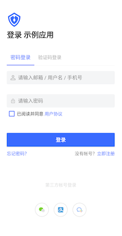
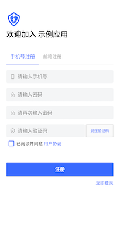
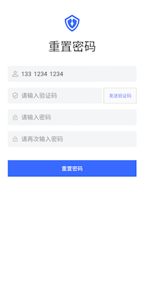

# 基于语义化思想的全新编程模型

## 什么是语义化

语义化是指将抽象的事物具象化当前语境下的过程。有几种语义化类型：

* 方式一：将一个概念放到上下文里面。比如猪是一个抽象的概念，放到动画片里面就是佩奇，放到中餐厅就是红烧肉，放到西餐厅就是烤肠。
* 方式二：在特定的业务场景里面，用子类型代替父类型。比如我们可以说“在山区里，我们看到了几只**山羊**在玩攀岩”，但当我们说”薅羊毛“的时候，我们几乎总是指绵羊。
* 方式三：为了满足一个特定需求，基于某个已有概念，创造出一个全新的类型。比如：

```java
class AnimatedDrawable extends Drawable
```

Drawable 是一种类型，用来表示任何可以被画出来的事物。而 AnimatedDrawable 是那些可以包含动画的 Drawable。
我们在现实生活中，几乎不会有人讨论 Drawable 和 AnimatedDrawable，他们只存在于计算机里面，某种意义上的元宇宙居民。

那到底是抽象的好，还是具体的好呢？

比较确定的一点是：在给定的一个业务场景下，肯定是具体的好。甚至，即使程序员打算使用抽象的工具，也必须将其具体化（在编程里面我们叫做实例化），否则业务就无法实现。比如我们的需求是在屏幕上显示一个图片，在主流的平台上，多半会这样写：

```java
Image image = new Image("x.png");
```

或者：

```java
Image image = SomeImageOrBitmapFactory.createImage("x.png");
```

在 createImage 内部，还是会创建一个 Image 实例。

然而在 C 语言里面，我们可以这样写：

```c
unsigned byte* data = loadImage("x.png");
```

那么问题来了，哪种好？这个问题其实就是高级语言 vs 底层语言的问题。

实际上，**编程语言本身也一种语义化**，计算机只认识高电压和低电压，是的，它们甚至对 0 和 1 都一无所知。当布尔发明 0 和 1 的时候，就迈出了语义化的第一步。对人类来说，数字也是描述物理世界的一种语义。后来的故事大家都听说了，我们觉得写很多 0 和 1 不够语义化，于是我们发明了 MOV，JUMP 这样的指令。如果将低电压/高电压用 0 和 1 表示是否称作语义化还有争议，那么 MOV，JUMP 的出现就非常明确了计算机编程语言发展的方向就是**语义化**。紧接着就是高级语言如 C 的出现以及面向对象语言如 SmallTalk，Java 的出现。程序员（英语国家老外）可以像写说明文一样写程序。

所以回答上面的问题，从开发效率角度上看，面向对象的写法比 C 语言写法更容易理解，更好维护。越底层语言的优势是运行效率更高。实际情况是，很多业务在今天都不太需要考虑本地运行效率问题，问题主要在开发效率上。

既然在给定的业务场景里面无论如何我们都要具像化，那为什么我们还要面对 int，String，Button，Image 这些抽象概念呢？我仔细看过原型图了，我这里要的是一个：

TwoPixelRoundedCornerWithTextOf_GOTOMARS_WithRedColorWith10LeftPaddingAndWhenClickedCall_Gotomars_FunctionButton

我不理解，苹果为什么不在 SDK 里面提供一个这样的 Button

很显然，苹果这辈子都不可能提供这样的 Button。它只会提供 Button 类型。实例化以及事件处理是程序员的事。

这里根本的冲突是：**编程语言以及平台 SDK 只提供了通用的组件和接口。**

不过相信大家也注意到，在一些特定业务场景，平台会提供更为具体的 SDK。比如在 Sign in with Apple 场景，苹果提供：

[ASAuthorizationAppleIDButton](https://developer.apple.com/design/human-interface-guidelines/sign-in-with-apple/overview/buttons/)

那语义化有没有缺点？缺点就是增加了概念，这让脑子里已经塞满了各种概念的程序员焦躁不安。

通过上面 Sign in with Apple 例子，我们意识到苹果创造出了一个新控件，这需要程序去了解，去学习。假设苹果提供的是一个 REST 请求地址，那我们就可以用已有知识自己构建这么一个按钮，即使用通用的 Button 加上通用的网络请求。

但我们认为，这种概念性的学习成本，在给定的业务场景里面是会被收益抵消的。因为程序员不管怎样都要学习这些概念。概念学习完后，与其自己花很多时间用 Button+REST 写，还不如直接用苹果提供的控件。对于那些想自己写的程序员，大概率是，最后自己封装了一个 SignInWithAppleButton，功能还不一定有苹果提供的 Button 完善。

回到我们认证领域，我们讨论的语义化是指将认证领域的编程元素具像化。这样更贴近最终业务，极大提高开发效率。这里的编程元素包括：UI、事件处理逻辑、流程。

我们能语义化是因为我们的场景是确切的。是的，我们会增加很多概念，但如上面讨论，这些概念在开发认证业务时，是无法忽略的。从长远来看，如果我们的概念是认证领域的通用标准，那程序员应该在大学时候就学习了这些概念，到了工作岗位上，他们应该能像使用 FileInputStream 这样的类一样熟练使用认证领域的标准控件和接口。毕竟，当前哪个业务不需要认证呢？

<br>

## 语义化编程模型

语义化编程有以下特点：

* 所有可交互组件语义化（Semanticalize all interactive widgets)
* 上下文感知（Context aware）
* 事件驱动（Event driven）
* 可嵌入（Embeddable）
* 数据实时同步（Realtime Data Syncing）

接下来我们逐一介绍。

<br>

* **所有可交互组件语义化**

语义化编程的第一步是将所有可交互的组件语义化。我们通过一个典型的认证流程来说明（以 Android 为例，其他平台类似）

 
 

这里的 “可交互” 包括：
1. 内容可以动态改变，如顶部的 Logo，它其实是可以在控制台配置的，所以它算是一个可交互的控件，需要被语义化
2. 用户可以操作。如按钮。虽然按钮的文字，背景都是固定的，但用户可以点击，所以它也算是可交互控件。

所以上面例子中的登录界面，包括“忘记密码”，“立即注册”这样的小按钮也需要被语义化为：ForgotPasswordButton, GotoRegisterButton

哪些不是可交互的呢？如下面灰色的“第三方帐号登录”文字，就不是可交互的，这样的控件不需要语义化，可以用平台自带的通用控件实现。

如果不使用语义化思想，为了实现这样的一个功能，我们要完成以下步骤：

1. 为每个页面创建控制器（Android 里面叫做 Activity）
2. 为每个页面创建布局文件
3. 每个控制器指定加载对应的布局文件
4. 每个页面布局文件里面，创建 Android 系统的各种通用控件，如 Button，TextView，为每个控件设置样式属性
5. 在控制器里面找到可交互的控件（findViewById or DataBinding）
6. 为每个可交互的控件编写事件响应代码
7. 事件响应代码里面会涉及到调用后台接口，需要熟悉了解每个接口的定义
8. 处理页面跳转，将需要的字段从当前页面传入下一个页面，并在下一个页面写代码获取需要的字段
9. 实现一些控件的特殊交互效果。如当输入框获得焦点，输入框的提示语可能要飞到顶部；当用户点击了“发送验证码”时，需要转圈，验证码发送成功后，需要倒计时；如果用户不勾选隐私协议就去点击登录，需要让该控件播放抖动动画等等非常多的细节

这些都很繁琐。所以很自然的，我们需要封装一些 UI 控件实现其中的一些细节，市面上有一些第三方库封装了一些能力，如 Google 提供的 TextInputLayout 实现了提示语向上飞的动画；[国家码选择器](https://github.com/hbb20/CountryCodePickerProject) 提供国旗、国家电话前缀、国家简称的展示以及搜索等功能。还有一些 SaaS 厂商会提供带网络请求的业务组件，开发者不用写代码自己去调用后台。到这里，基本也就到头了。

然而事实上，这只是一个开端，我们发现即使使用了这些第三方库，还是有大量繁琐的，重复的工作要做。我们必须更进一步。

我们在语义化这条路上走得很远，语义化真正的力量是需要和下面几个思想相结合才能爆发出来。当然前提是，所有可交互的控件都已经被我们自定义了，不能有漏网之鱼。

<br>

* **上下文感知**

人类的思维模式是有上下文的，或者叫语境，中文尤其突出。尝试理解下面这句话：能穿多少穿多少。到底穿多还是穿少？放到上下文就清晰了：

北京冷，能穿多少穿多少

深圳热，能穿多少穿多少

所以当我们看到一个登录界面的时候，我们是不会看到 TextView，Input，Button 这些抽象物体的。因为我们已经有上下文了。所以很自然的，我们脑海里面会出现下面的概念：

* 电话号码输入框
* 密码输入框
* 忘记密码按钮
* 登录按钮
* 等等

如果出现下面反人类的概念，恭喜你，你是一个合格的程序猿

* 一个提示语为“请输入电话”，输入类型为数字，左右间距为 24，聚焦后背景为蓝色倒角矩形的**输入框**，小名阿花
* 一个提示语为“请输入密码”，输入类型为密码，左右间距为 24，聚焦后背景为蓝色倒角矩形的**输入框**，小名阿猫
* 一个文本为“忘记密码”，字体颜色为蓝色，点击后跳转到忘记密码界面的**按钮**
* 一个文本为“登录”，字体颜色为白色，点击后先播放转圈动画，再去找到阿花，阿猫的文字内容，将其作为参数传给登录网络接口，然后发起网路请求，如果成功则跳转到登录界面，同时停止转圈动画的**按钮**

接下来，当用户点击登录按钮的时候，从人的角度看，很自然的，分两步：

1. 我们需要从电话号码输入框和密码输入框里面获取数据
2. 然后通过网路将手机号码和密码传给服务器，完成认证

第一步对我们来说是一目了然的，我们的视野覆盖了整个屏幕。第二步也很自然，因为我们知道我们刚刚输入了手机号码和密码，而不是邮箱和密码，也不是手机和验证码，也不是微信授权码。我们之所以对我们的业务这样的明确是因为我们了解上下文，一切都显得理所当然。

然而对于计算机来说，事情就没有那么简单了，我们不得不干以下反直觉的事情。

1. 在设计界面的时候，我们就得给输入框编造一个 ID，以备后用
2. 在进入页面的时候，通过 findViewById 或者其他 binding 手段保存手机号码输入框、密码输入框、登录按钮的引用
3. 为登录按钮设置一个 onClick 事件
4. 在 onClick 回调里面，调用输入框的 getText 方法获得数据
5. 需要编写一个变量来保存当前是什么输入模式，以便在调用网路请求的时候，能知道是调用 loginByPhonePassword 还是 loginByPhoneCode 或是其他什么接口

之所以会这样，原因很简单，安卓平台不提供语义化组件，它也无法感知上下文。它只知道有两个输入框一个按钮，但不知道谁是谁，分别用来干嘛。它这样设计是为了解决通用问题，因为安卓平台面向各行各业，注定只能提供高度抽象的控件。

但我们知道上下文。

于是我们在布局文件里面放置了：PhoneNumberEditText, PasswordEditText, LoginButton

这样的组合一下就改变了整个编程思路。我们不再需要 ID 了。我们从 *通用类型+ID* 的思维模式转为 *具体类型*。这样的好处是，对于 LoginButton 来说，它就可以直接去找当前页面类型为 PhoneNumberEditText, PasswordEditText 的控件，从而拿到数据。这在之前是做不到的，ID 是在具体业务开发的时候才能确定，我们无法提前开发一个能感知上下文的 LoginButton。另外一个好处是，LoginButton 可以通过查找当前可见区域是包含 PhoneNumberEditText, PasswordEditText 的组合还是包含 PhoneNumberEditText, VerifyCodeEditText 的组合，从而确定调用哪个网络请求做认证。这是不是和上面人类的思维模式更贴切了？

另外一方面，从业务角度出发，应用只关心认证结果，所以只需要一个回调就够了：onAuth。而不是去监听登录按钮的点击事件。原因在于，登录按钮只发起了电话+密码认证，事实上，中间用户可能新注册了帐号，可能弹到系统设置里面去了（如 Sign with Apple），或者触发了 MFA（Multi-Factor Authentication），这就要求应用侧需要对整个认证细节非常了解，并花很多时间去处理各种逻辑。代码会写成这样：

```java
button.setOnClickListener((view)->{
    AuthClient.loginByPhonePassword(result->{
        if (result.loginBySystemAccount) {
            // goto system account login
            systemAccount.auth(r->{

            })
        } else if (result.gotoFaceMFA) {
            // handle facial auth
            face.auth(r->{

            })
        } else if (result.gotoCapchaMFA) {
            // open capcha
            capcha.auth(r->{

            })
        }
    });
});
```

小结一下，通过组件语义化，我们一方面提供了给定业务的常见功能从而避免重复造轮子，另一方面我们使组件拥有了感知上下文的可能。通过上下文感知，我们又进一步避免了发明无用的 ID，绑定数据，区分网络接口等繁琐工作。到这里我们的代码已经简化到只需要监听 onAuth 事件。

但真正彻底颠覆开发模式的，是下面介绍的事件驱动。

<br>

* **事件驱动**