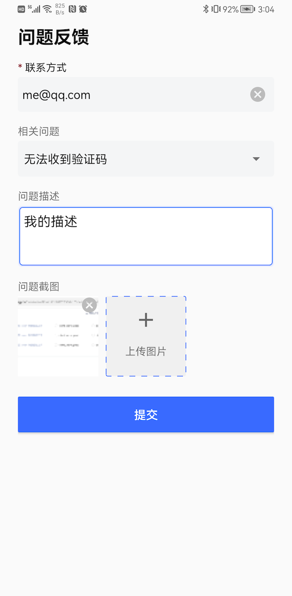
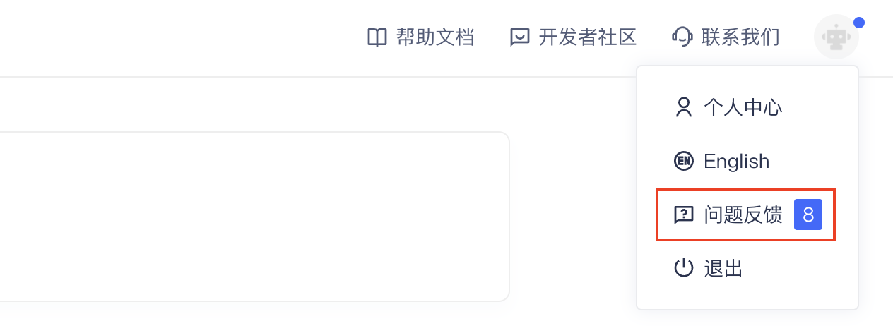

# 问题反馈

如果应用使用了我们提供的登录界面，该界面会自带问题反馈入口。应用也可以通过下面的方式独立使用：

1. 引入依赖：

```groovy
implementation 'cn.authing:guard:+'
```

2. 在应用启动（如 App.java）里面调用：

```java
Authing.init(appContext, "your_authing_app_id");
```

3. 打开问题反馈界面：

```java
Intent intent = new Intent(this, FeedbackActivity.class);
startActivity(intent);
```

效果如下：



> 注意：联系方式为必填项；最多可以上传 8 张截图

管理员可以在 console 里面，点击右上角个人图标，然后点击 “问题反馈” 来查看和处理用户提交的问题：

