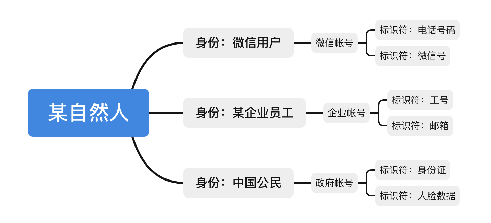

# 身份基础

Guard 是一个前端 SDK，在了解 Guard 之前，有必要先了解 Guard 相关的基础概念，理解 Guard 所在的身份认证领域。

身份管理是指将自然人或者实体在物理世界的身份以及该身份的各种属性，通过信息化技术手段，以帐号的形式，储存并管理起来。下面几个重要的基本概念可以帮助我们理解这个过程：

* 身份（Identity）
* 帐号（Account）
* 标识符（Identifier）

 

## 身份（Identity）

身份是一个自然人或者一个实体在特定上下文中的属性集合。举例来说，假设我的身份是星际探索公司的食堂系统 Java 程序员，那么这里的上下文是：处理企业员工相关问题的系统。可能的属性集合包括工号，公司，部门，职位等。

特别注意区分身份和角色。这和我们平时说的身份还有点微妙的区别。比如平时我们可以说：**我的身份是父亲。** 这里的父亲其实是一种角色，很多人都扮演着父亲这种角色。准确的表述应该为：

* 我的角色是父亲
* 我是 xxx 的父亲

这里的身份是要具体到一个人，或者一个帐号的。而角色里面包含多个人，多个帐号。

很显然，一个自然人是可以有多个身份的。他可以同时是微信的用户和某公司的员工。

还有一类身份，他不代表具体的某个人，而是某个岗位、某台设备、某个应用、某个流程。我们将这类身份称作*非自然人身份*（Nonhuman Identity）

和上面讨论的一样，这里的岗位是要具体到一条帐号记录的。比如“保安”就不是这里的身份。保安是一种角色。“xx 小区西门的门岗”就是一个身份，虽然这个身份可以共享给多名具体的安保人员。

接下来，我们再看看帐号。

 

## 帐号（Account）

帐号是物理世界的身份在 IT 系统里面的一条记录，通常存储在数据库里面（当然也可以手写或者用 Excel），它和身份是一一对应的（一对一关系）。帐号的根本作用是**确保数字资源能被合法访问。** 举例：

如果某系统要访问用户的个人信息，要么提供一种机制让用户本人登录进去，要么提供一种机制让用户可以授权给其他用户进行访问。所以帐号管理系统（IdM）需要支持认证和权限管理。当然，首先得支持增删改查。（这年头谁不支持增删改查）

 

## 标识符（Identifier）

假设楼下发廊有一条规则是要想预约 Tony 老师理发，必须是本发廊会员。那么“一名会员”就是我需要的身份。而**会员号**就是身份标识符。标识符不一定只有一个，可以为多个，只要在系统内能保证唯一性。通常手机号也可以作为发廊会员的标识符。其他常见的标识符有用户名，邮箱，工号。我们定义标识符**是在一个特定上下文中能唯一识别一个身份的字段**。

>标识符是和上下文强相关的

标识符有两层涵义：

* 它可以指某系统在众多身份属性中，挑选出来的全局唯一的字段。如电话，邮箱。
* 它也可以指某个用作身份识别字段的具体值。如 133 **** 1234

所以在使用一个系统前，我们首先要搞清楚哪些字段可以用作标识符来识别身份。也就是“如何描述我是一个有身份的人”。在上面发廊的例子里面，我车库里的橙色兰博基尼是不能证明我身份的，从而导致我无法预约到 Tony 老师。搞清楚字段后，我们还需要获取一个具体的值，也就是说我需要到店里去开通会员，可能需要我预充值，也可能是因为 Tony 老师和我是亲戚。

还有一种特殊的标识符，是 IT 系统内部为某条记录自动生成的一段数据。一般来说，长度是固定的。它可以是完全随机，也可以编码一些信息，如前 3 位为国家码，后面 4 位为区域码等。这种标识符一般对最终用户不可见，主要在系统内部或系统之间通过代码使用。

 

## 图例

